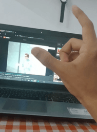

# Project Name

A simple virtual mouse and volume controller built using Mediapipe and Opencv.
[](https://www.youtube.com/watch?v=dQw4w9WgXcQ)
## Table of Contents

- [Installation](#installation)
- [Usage](#usage)
- [References](#references)


## Installation

Before you begin, ensure you have met the following requirements:

- Python 3.6 or higher installed.
- A webcam connected to your computer.

Use the package manager [pip](https://pip.pypa.io/en/stable/) to install the required packages

```bash
pip install -r requirements.txt
```

## Usage

Run the [virtual mouse  script](mouse.py)
```bash
py mouse.py
```

Run the [virtual volume controller script](volume.py)
```bash
py volume.py
```

## References

- [MediaPipe](https://developers.google.com/mediapipe): The core hand tracking and pose estimation library that powers this project.
- [OpenCV](https://opencv.org/get-started/): The computer vision library that makes webcam integration seamless.

### Merci :)